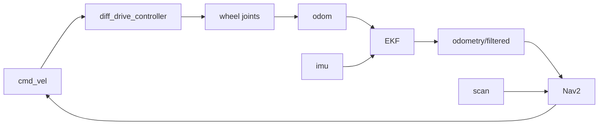

# Carter 移动机器人系统集成 Final Report

## 小组信息

- 小组名：`【需要替换】`
- 成员：`【需要替换】`
- 日期：`【需要替换】`
- 仓库地址：`【需要替换】`

## 1. 摘要

`【需要替换：用 3-5 句话总结最终系统实现了什么、实验结果如何、最重要的失败和结论】`

## 2. 系统架构



## 3. 组件说明

| 组件 | 作用 | 关键 topic |
|---|---|---|
| diff_drive_controller | 差速底盘速度控制 | `/cmd_vel`、`/odom` |
| robot_state_publisher | 发布静态 TF | `/tf_static` |
| EKF | 融合轮速里程计和 IMU | `/odometry/filtered` |
| SLAM Toolbox | 室内建图 | `/map`、`/scan` |
| AMCL | 地图定位 | `/amcl_pose` |
| Nav2 | 路径规划、控制、避障 | `/plan`、`/cmd_vel` |

## 4. Carter bringup

`【需要替换：说明启动命令、健康检查结果、速度限制和安全停止】`

```bash
ros2 launch week8/launch/full_bringup.launch.py
```

## 5. 室内地图与定位

- 地图来源：`【需要替换】`
- 地图参数：`【需要替换】`
- AMCL 是否收敛：`【需要替换】`
- 定位误差：`【需要替换】`
- 证据：`evidence/screenshots/amcl.png`

## 6. 室内导航与避障

- 单点导航结果：`【需要替换】`
- 多点导航结果：`【需要替换】`
- 动态障碍结果：`【需要替换】`
- 主要调参：`【需要替换】`
- 证据：`evidence/screenshots/nav.png`、`evidence/logs/nav_log.txt`

## 7. 室外 waypoint / 降级演示

- 采用方案：`【需要替换】`
- 结果：`【需要替换】`
- 证据：`evidence/videos/outdoor_demo.mp4`

## 8. 失败与经验总结

### 案例 1

- 现象：`【需要替换】`
- root cause：`【需要替换】`
- 解决方式：`【需要替换】`

### 案例 2

- 现象：`【需要替换】`
- root cause：`【需要替换】`
- 解决方式：`【需要替换】`

## 9. 未来改进方向

`【需要替换：例如加入重定位 UI、提高 RTK 可靠性、使用 costmap filters、完善自动测试】`

## 10. 证据索引

- `evidence/screenshots/`
- `evidence/logs/`
- `evidence/rosbag/`
- `evidence/videos/`
